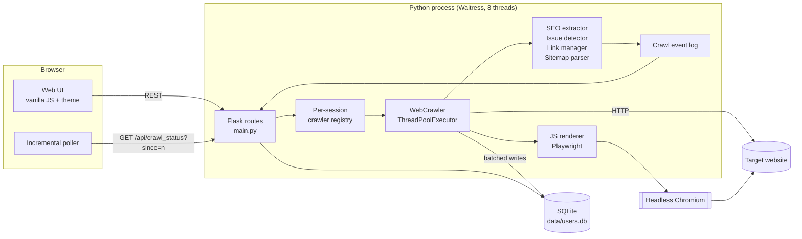
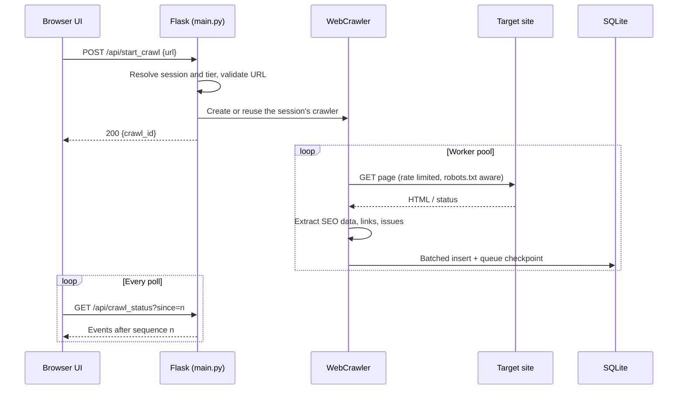
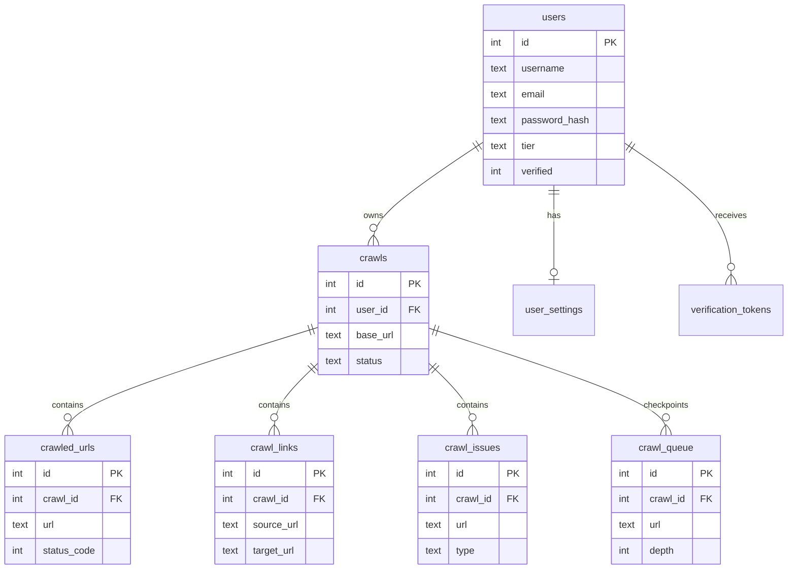
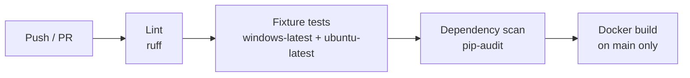

<p align="center">
  
</p>

<h1 align="center">Bemol Crawler</h1>

<p align="center">
  Self-hosted technical SEO crawler used to audit <code>bemol.com.br</code>.<br>
  A branded, Windows-friendly distribution of <a href="https://github.com/PhialsBasement/LibreCrawl">LibreCrawl</a>.
</p>

<p align="center">
  
  
  
  
  
</p>

---

## Table of Contents

- [Project Overview](#project-overview)
- [Architecture](#architecture)
- [Technology Stack](#technology-stack)
- [Features](#features)
- [Project Structure](#project-structure)
- [Data Flow](#data-flow)
- [Installation](#installation)
- [API Documentation](#api-documentation)
- [Database Design](#database-design)
- [Security](#security)
- [Testing Strategy](#testing-strategy)
- [Observability](#observability)
- [CI/CD Pipeline](#cicd-pipeline)
- [Infrastructure](#infrastructure)
- [Performance Considerations](#performance-considerations)
- [Crawling VTEX Stores](#crawling-vtex-stores)
- [Engineering Practices](#engineering-practices)
- [Technical Decisions](#technical-decisions)
- [Challenges and Lessons Learned](#challenges-and-lessons-learned)
- [Roadmap](#roadmap)
- [Contributing](#contributing)
- [License](#license)
- [Author](#author)

---

## Project Overview

### Executive Summary

Bemol Crawler is a web-based SEO spider that crawls a website, extracts on-page
SEO signals, maps internal and external links, detects technical issues, and
exports the results. It runs entirely on a single workstation: no Docker, no
external database, and no cloud account are required.

### Business Context

Technical SEO audits of a large VTEX storefront such as `bemol.com.br` require
crawling tens of thousands of URLs (product, category, and institutional pages)
on a recurring basis. Commercial crawlers are licensed per seat and per year,
and corporate workstations often block the tooling that open source
alternatives assume (Docker Desktop, administrator rights, unrestricted script
execution).

### Technical Context

This repository is a fork of LibreCrawl. It keeps the upstream crawler engine
intact and adds:

- A native Windows startup path that works under corporate restrictions
  (64-bit Python detection, virtualenv outside OneDrive, UTF-8 console fix).
- A configurable bind address so single-user local mode is reachable from
  `127.0.0.1` only.
- A Bemol visual identity applied as an isolated theme layer, so upstream
  changes can still be merged with minimal conflict.

### Main Objectives

- Run recurring SEO audits of `bemol.com.br` on a locked-down corporate laptop.
- Keep the fork cheap to maintain by concentrating custom code in new files.
- Keep crawl data local to the machine running the audit.

### Key Benefits

| Benefit | How it is achieved |
|---|---|
| Zero licensing cost | MIT-licensed upstream engine |
| Runs without Docker or admin rights | Per-user Python virtualenv and a Chromium build downloaded by Playwright |
| Renders JavaScript storefronts | Headless Chromium through Playwright |
| Resumable long crawls | Crawl queue and results checkpointed to SQLite |
| Upstream-friendly fork | Theme and branding live in separate files |

---

## Architecture

### Architectural Style

The application is a **modular monolith** with a **layered** internal structure,
served by a single Python process. The browser UI is a thin client that polls
an incremental event stream.

| Layer | Location | Responsibility |
|---|---|---|
| Presentation | `web/templates`, `web/static` | Jinja2 pages, vanilla JS UI, plugins, theme |
| Interface (HTTP) | `main.py` | Flask routes, session handling, per-user crawler registry |
| Application | `src/crawler.py` | Crawl orchestration, worker pool, pause/resume, checkpointing |
| Domain | `src/core/*` | SEO extraction, issue detection, link graph, sitemap parsing, rate limiting |
| Infrastructure | `src/crawl_db.py`, `src/auth_db.py`, `src/core/js_renderer.py`, `src/email_service.py`, `src/zoho_oauth.py` | SQLite persistence, headless browser, SMTP, OAuth |

### High-Level Architecture



### Design Patterns

| Pattern | Where | Purpose |
|---|---|---|
| Registry | `crawler_instances` in `main.py` | One isolated crawler per browser session |
| Worker pool | `ThreadPoolExecutor` in `src/crawler.py` | Bounded concurrent fetching |
| Token bucket | `src/core/rate_limiter.py` | Smooth, polite request pacing against the target site |
| Event sourcing (in-memory) | `src/core/event_log.py` | Monotonic event sequence so the UI receives only deltas |
| Batch writer / checkpoint | `_save_batch_to_db`, `_save_queue_checkpoint` | Crash-safe persistence without per-row commits |
| Plugin registry | `web/static/js/plugin-loader.js` | Drop-in UI tabs without touching core code |
| Design tokens | `web/static/css/theme-bemol.css` | Single source of truth for brand colors |

---

## Technology Stack

| Layer | Technology | Purpose |
|---|---|---|
| Language | Python 3.9+ (64-bit) | Backend and crawler |
| Language | JavaScript (ES2017+, no build step) | Browser UI |
| Web framework | Flask 2.3 | Routing, sessions, templating |
| WSGI server | Waitress | Multi-threaded production server, Windows compatible |
| HTTP client | Requests + urllib3 | Page fetching with connection pooling |
| HTML parsing | BeautifulSoup 4 | SEO signal extraction |
| JS rendering | Playwright (Chromium, Firefox, WebKit) | Rendering client-side storefronts |
| Database | SQLite (WAL mode) | Users, settings, crawl results, resumable queue |
| Authentication | bcrypt, Flask sessions, optional Zoho OAuth 2.0 | Multi-user mode |
| Graph visualization | Cytoscape.js | Site structure graph |
| Exports | csv, openpyxl, json, xml.etree | CSV, XLSX, JSON, and XML exports |
| Compression | Flask-Compress (gzip, brotli) | Smaller polling payloads |
| Process metrics | psutil | Memory guardrails per crawl |
| Configuration | python-dotenv | `.env` based configuration |
| Containerization | Docker, Docker Compose | Optional, for servers where Docker is available |
| Testing | Plain Python scripts with local fixture servers | Deterministic regression tests |
| Caching / messaging / cloud / CI | Not used | See [Infrastructure](#infrastructure) and [CI/CD](#cicd-pipeline) |

---

## Features

### Current Features

- [x] Configurable crawl depth, URL limit, delay, and concurrency
- [x] `robots.txt` compliance and automatic sitemap discovery
- [x] JavaScript rendering with headless Chromium
- [x] On-page SEO extraction: title, meta description, headings, canonical, Open Graph, JSON-LD, word count, image alt text
- [x] Internal and external link mapping, with link-check-only external rows
- [x] Automated issue detection with configurable exclusion patterns
- [x] HTTP status filtering (2xx, 3xx, 4xx, 5xx, no response)
- [x] PageSpeed Insights integration (Core Web Vitals)
- [x] Interactive site structure visualization
- [x] Pause, resume, and crash recovery for long crawls
- [x] Crawl history with load, resume, archive, and delete
- [x] Exports in CSV, XLSX, JSON, and XML
- [x] UI plugin system (E-E-A-T analysis plugin included)
- [x] Single-user local mode bound to `127.0.0.1`
- [x] Native Windows startup script without Docker
- [x] Bemol visual identity on the main crawl page

### Planned Features

- [ ] Bemol theme on the login, register, and dashboard pages
- [ ] Light theme as default with a persisted dark mode toggle
- [ ] Self-hosted fonts and Cytoscape for fully offline use
- [ ] Configurable data directory outside OneDrive-synced folders
- [ ] GitHub Actions pipeline running the fixture tests

### Future Roadmap

- [ ] Scheduled recurring audits with crawl-to-crawl diff reports
- [ ] VTEX-specific issue rules (product availability, faceted URL canonicals)
- [ ] Scheduled summary reports for the SEO team

---

## Project Structure

```text
.
├── main.py                      # Flask app: routes, sessions, crawler registry, exports
├── src/
│   ├── crawler.py               # Crawl orchestration, worker pool, checkpoints
│   ├── crawl_db.py              # Crawl persistence (SQLite)
│   ├── auth_db.py               # Users, tiers, verification tokens (SQLite)
│   ├── settings_manager.py      # Settings schema, defaults, and validation
│   ├── email_service.py         # SMTP verification emails
│   ├── zoho_oauth.py            # Optional Zoho OAuth login
│   └── core/
│       ├── seo_extractor.py     # On-page SEO signal extraction
│       ├── issue_detector.py    # SEO issue rules
│       ├── link_manager.py      # Link graph and link status tracking
│       ├── sitemap_parser.py    # Sitemap discovery and parsing
│       ├── js_renderer.py       # Playwright headless rendering
│       ├── rate_limiter.py      # Token bucket request pacing
│       ├── event_log.py         # Incremental event stream for the UI
│       ├── memory_monitor.py    # Process memory guardrails
│       └── memory_profiler.py   # Per-user memory accounting
├── web/
│   ├── templates/               # Jinja2 pages (index, login, register, dashboard)
│   └── static/
│       ├── css/
│       │   ├── styles.css       # Upstream base styles
│       │   └── theme-bemol.css  # Bemol design tokens and overrides
│       ├── js/                  # UI logic, incremental poller, visualization
│       ├── plugins/             # Drop-in UI plugins
│       └── brand/               # Logo variants and favicons
├── logo/                        # Source logo artwork
├── tests/
│   ├── fixture_tests.py         # Deterministic regression tests (local servers)
│   └── crawl_harness.py         # End-to-end harness against a live site
├── data/                        # SQLite database (created at runtime, git-ignored)
├── start-librecrawl-local.bat   # Native Windows startup (no Docker)
├── start-librecrawl.bat / .sh   # Upstream startup scripts (Docker first)
├── Dockerfile
├── docker-compose.yml
└── .env.example
```

**Fork boundary:** Bemol-specific code lives in `theme-bemol.css`, `web/static/brand/`,
`logo/`, and `start-librecrawl-local.bat`. Changes to upstream files are limited to
small, reviewable edits so that `git merge upstream/main` stays practical.

---

## Data Flow



1. **Request received:** the UI posts the start URL. In local mode the session
   is auto-authenticated as the local admin user.
2. **Validation:** the URL, tier limits, and crawler settings are checked. Settings
   are range-validated in `settings_manager.py` (for example, depth 1-10,
   concurrency 1-50, delay 0-60 s).
3. **Business rules:** workers fetch pages, apply `robots.txt` and include or
   exclude patterns, optionally render JavaScript, extract SEO signals, and
   run issue detection.
4. **Persistence:** results are written to SQLite in batches, and the pending
   queue is checkpointed so a crashed or stopped crawl can resume.
5. **Response:** every mutation becomes an event with a monotonic sequence
   number. The UI requests only events it has not seen, so polling cost stays
   flat as the crawl grows.

---

## Installation

### Prerequisites

| Requirement | Notes |
|---|---|
| Python 3.9+ **64-bit** | Playwright does not ship 32-bit Windows builds |
| ~500 MB disk | Virtualenv plus Chromium headless shell |
| Outbound HTTPS | PyPI, Playwright CDN, and the target site |
| Docker | Optional |

Check the architecture of your Python:

```bash
python -c "import struct; print(struct.calcsize('P') * 8)"   # must print 64
```

### Clone Repository

```bash
git clone https://github.com/fabricio-hunt/bemol-crawler.git
cd bemol-crawler
```

### Environment Variables

Copy `.env.example` to `.env`. A minimal single-user setup:

```dotenv
# Auto-login as local admin, no rate limits. Never expose this to a network.
LOCAL_MODE=true

# Bind address and port
HOST=127.0.0.1
PORT=5000

# Required for multi-user deployments so sessions survive restarts
# SECRET_KEY=<python -c "import secrets; print(secrets.token_hex(32))">
```

| Variable | Default | Description |
|---|---|---|
| `LOCAL_MODE` | `false` | Disables authentication and grants admin to every visitor |
| `HOST` | `0.0.0.0` | Interface to bind (`127.0.0.1` = this machine only) |
| `PORT` | `5000` | HTTP port |
| `SECRET_KEY` | random per start | Session signing key |
| `REGISTRATION_DISABLED` | `false` | Blocks new sign-ups |
| `DISABLE_GUEST` | `false` | Blocks guest login |
| `DEMO_MODE` | `false` | 1.5 GB memory cap per user |
| `ZOHO_OAUTH_ENABLED` | `false` | Adds "Login with Zoho" (see `.env.example`) |
| `SMTP_*`, `MAIN_APP_URL` | unset | Verification emails in multi-user mode |

### Local Development

**Windows (recommended on corporate machines):**

```bat
start-librecrawl-local.bat
```

The script finds a 64-bit Python, creates a virtualenv in
`%LOCALAPPDATA%\LibreCrawl\venv` (outside OneDrive), reinstalls dependencies
when `requirements.txt` changes, installs Chromium, and starts the app on
`http://localhost:5000`.

**Manual (any OS):**

```bash
python -m venv .venv
# Windows: .venv\Scripts\activate    Linux/macOS: source .venv/bin/activate
pip install -r requirements.txt
python -m playwright install chromium
python -X utf8 main.py --local --host 127.0.0.1
```

`-X utf8` avoids a `UnicodeEncodeError` on Windows consoles that use code page 1252.

### Docker Setup

```bash
cp .env.example .env
docker compose up -d
# http://localhost:5000
```

The compose file publishes the port on `${HOST_BINDING:-127.0.0.1}` and mounts
`./data` for persistence. Inside the container the app binds to `0.0.0.0`,
which is required for port publishing.

### Production Deployment

For a shared, multi-user instance:

1. Set `LOCAL_MODE=false`, a fixed `SECRET_KEY`, and `REGISTRATION_DISABLED=true`
   (or Zoho OAuth restricted with `ZOHO_ALLOWED_DOMAINS`).
2. Run behind a TLS-terminating reverse proxy (Caddy or nginx).
3. Back up `data/users.db` (WAL mode: back up with the app stopped or use
   `sqlite3 .backup`).

---

## API Documentation

All endpoints are session-authenticated (automatic in local mode) and exchange JSON.

| Method | Endpoint | Description |
|---|---|---|
| `POST` | `/api/start_crawl` | Start a crawl for `{ "url": "..." }` |
| `POST` | `/api/stop_crawl` | Stop the session's crawl |
| `POST` | `/api/pause_crawl` / `/api/resume_crawl` | Pause or resume the active crawl |
| `GET` | `/api/crawl_status` | Crawl state and incremental events |
| `GET` | `/api/visualization_data` | Nodes and edges for the site graph |
| `POST` | `/api/filter_issues` | Re-apply issue exclusion patterns |
| `GET` / `POST` | `/api/get_settings`, `/api/save_settings`, `/api/reset_settings` | User settings |
| `GET` | `/api/crawls/list`, `/api/crawls/stats` | Crawl history |
| `GET` | `/api/crawls/<id>` | Crawl metadata |
| `POST` | `/api/crawls/<id>/load`, `/resume`, `/archive` | Load, resume, or archive a saved crawl |
| `DELETE` | `/api/crawls/<id>/delete` | Delete a saved crawl |
| `GET` | `/api/export_stream` | Streaming export (CSV, XLSX, JSON, XML) |
| `POST` | `/api/login`, `/api/register`, `/api/guest-login`, `/api/logout` | Authentication (multi-user mode) |
| `GET` | `/auth/zoho/login`, `/auth/zoho/callback` | Zoho OAuth flow |

**Start a crawl**

```bash
curl -c cookies.txt -b cookies.txt http://127.0.0.1:5000/ -o /dev/null
curl -c cookies.txt -b cookies.txt \
     -H "Content-Type: application/json" \
     -d '{"url": "https://www.bemol.com.br"}' \
     http://127.0.0.1:5000/api/start_crawl
```

```json
{ "success": true, "crawl_id": 4, "message": "Crawl started successfully" }
```

**Poll status**

```bash
curl -b cookies.txt http://127.0.0.1:5000/api/crawl_status
```

The response includes `status` (`running`, `paused`, `completed`), aggregate
`stats`, and the URL, link, and issue events the client has not yet received.

**Authentication flow (multi-user mode):** `POST /api/login` validates the
bcrypt hash and stores `user_id` and `tier` in a signed session cookie. With
Zoho enabled, `/auth/zoho/login` starts an OAuth 2.0 authorization code flow
and the callback links or creates the account by verified email.

Upstream reference: [librecrawl.com/api/docs](https://librecrawl.com/api/docs/).

---

## Database Design

A single SQLite file (`data/users.db`) in WAL mode.



Supporting tables: `guest_crawls` (IP-based guest quota), `crawl_history`, and
`user_settings`. The diagram shows the main columns only.

**Data model decisions**

- **SQLite over a server database:** zero administration and a single file to
  back up, which suits one analyst per machine. WAL mode allows the UI to read
  while the crawler writes.
- **Queue persisted as a table:** makes pause, resume, and crash recovery
  possible without an external broker.
- **Per-crawl child tables:** deleting or archiving a crawl is a scoped operation.

---

## Security

| Concern | Current state |
|---|---|
| Authentication | bcrypt password hashes, signed Flask session cookies, optional Zoho OAuth 2.0 |
| Authorization | Tier model (`guest`, `user`, `extra`, `admin`); guests limited to 3 crawls per IP per 24 h |
| Local mode | Disables authentication entirely. Bind to `127.0.0.1` (default in `start-librecrawl-local.bat` and `.env`) |
| Secrets management | Environment variables and a git-ignored `.env`; no secrets in the repository |
| Encryption in transit | None built in; terminate TLS at a reverse proxy for shared deployments |
| Input validation | Settings validated against typed ranges; URLs normalized before crawling |
| Rate limiting | Token bucket towards target sites; per-tier limits for users |
| OWASP notes | Jinja2 auto-escaping for templates; `DANGEROUSLY_SKIP_AUTH` must never be enabled on a network |

> **Warning:** never combine `LOCAL_MODE=true` with `HOST=0.0.0.0` on a corporate
> network. Every visitor would receive admin access.

---

## Testing Strategy

| Level | Tool | Scope |
|---|---|---|
| Regression (deterministic) | `tests/fixture_tests.py` | Crawler behavior against local HTTP fixture servers; no internet access |
| End-to-end | `tests/crawl_harness.py` | Live crawl through the HTTP API using the same event protocol as the UI |
| Manual UI | Browser | Theme, visualization, and export checks |

```bash
# Deterministic suite (exit code != 0 on failure)
python -X utf8 tests/fixture_tests.py

# End-to-end against a live site (app must be running)
python -X utf8 main.py --local --host 127.0.0.1
python -X utf8 tests/crawl_harness.py https://example.com/ --max-urls 150
```

Current result on Windows 11, Python 3.14 64-bit: **58 passed, 0 failed**.

Each fixture test pins a bug that previously reached production (cross-domain
redirects, image budget accounting, event ordering, duplicate detection
complexity, export formats). See [`tests/README.md`](tests/README.md).
Coverage is not measured yet. New crawler behavior should ship with a fixture test.

---

## Observability

| Signal | Implementation |
|---|---|
| Logs | Structured console output from Waitress and the crawler (`log_level` setting) |
| Metrics | Live crawl statistics in the UI; process memory via psutil |
| Memory diagnostics | `/debug/memory` page and `/api/debug/memory` endpoints (admin) |
| Tracing, dashboards, alerting | Not implemented |

For a shared deployment, the natural next step is shipping stdout to the
existing log platform and exposing crawl counters to Prometheus. This is not
needed for single-user local use.

---

## CI/CD Pipeline

There is no pipeline yet. The proposed first iteration:



Running the fixture tests on `windows-latest` matters for this fork, because
the Windows startup path is its main reason to exist.

---

## Infrastructure

The target runtime is a **single workstation**. No cloud services, IaC, or
container orchestration are used or required.

| Environment | Runtime | Data |
|---|---|---|
| Analyst laptop (primary) | Native Python virtualenv via `start-librecrawl-local.bat` | Local SQLite |
| Server with Docker (optional) | `docker compose` | `./data` volume |

If a shared instance becomes necessary, a single small VM or container service
with a persistent volume is sufficient. SQLite keeps it to one stateful component.

---

## Performance Considerations

- **Parallelism:** a bounded worker pool (default concurrency 5, up to 50)
  paced by a per-host adaptive rate limiter. Page requests follow the
  configured crawl delay (default 1 s, so about 60 pages per minute); image
  CDN hosts start unpaced and slow down only when they throttle. See
  [Crawling VTEX Stores](#crawling-vtex-stores) for tuning.
- **Incremental polling:** clients receive only events after their last sequence
  number, and responses are compressed.
- **Batched persistence:** rows are committed in batches instead of per URL.
- **Memory guardrails:** `memory_monitor` and a per-user memory tracker stop
  runaway crawls. `DEMO_MODE` enforces a hard 1.5 GB cap.
- **Duplicate detection:** linear-time grouping (pinned by a fixture test)
  instead of pairwise comparison.
- **JavaScript rendering is expensive:** enable it only for sections that need
  it. Most VTEX pages expose SEO-critical tags in the server-rendered HTML.
- **Cost:** no infrastructure cost for local use.

---

## Crawling VTEX Stores

VTEX applies undisclosed rate limits per IP, account, and route at its edge,
and they vary during the day. A throttled request receives `429 Too Many
Requests` with a `Retry-After` header; an overloaded app returns `503`
([VTEX docs](https://developers.vtex.com/docs/guides/how-to-load-test-a-store),
[rate limit best practices](https://developers.vtex.com/docs/guides/best-practices-for-avoiding-rate-limit-errors)).

### How the crawler reacts

| Mechanism | Behavior |
|---|---|
| Pacing | Every page request goes through the host's rate limiter at the configured crawl delay |
| Single request per page | Pages are fetched with one streamed `GET`; the size limit is checked from headers, with no pre-flight `HEAD` |
| `Retry-After` | 429/503 pause every request to that host for the time the server asked (capped at 300 s), or an exponential backoff with jitter |
| Adaptive rate | Each 429/503 halves the host's rate (floor 0.2 req/s); 20 consecutive successes restore 10% of the configured rate |
| Status-aware retries | 429/502/503/504 are retried up to the configured retries; the status is recorded only if every attempt fails |
| Per-host isolation | Image CDN hosts (`vteximg.com.br`, `vtexassets.com`) have their own limiter, so a throttling CDN does not slow page fetches. External links are never paced |
| Visibility | The sidebar shows the number of CDN blocks (429/503), and the progress line names the hosts being throttled |

### Recommended settings

| Setting | Value | Reason |
|---|---|---|
| Crawl Delay | 0.3 to 0.5 s | Steady pace below the edge limit; the limiter backs off further on its own |
| Concurrency | 2 to 3 | Pacing, not parallelism, sets throughput; fewer open connections look less like a burst |
| Verificar status das imagens | Off for large crawls | Removes one `HEAD` per new image from the request volume |
| User Agent | Keep `BemolCrawler/1.0 (SEO Crawler)` | Stable and identifiable, required for an allowlist |
| Exclude Patterns | See below | Faceted and search URLs multiply the crawl size without SEO value |

```text
*?map=*
*?O=*
*_q=*
*?PS=*
/busca*
/checkout*
/account*
/api/*
```

### Operational measures

- **Allowlist:** open a VTEX support ticket with the crawler's fixed egress IP,
  its User-Agent, the crawl window, and the expected volume, and ask for the
  limit to be relaxed for that IP. This is the supported way to lift the limit
  for our own store.
- **Off-peak windows:** run full crawls at night, when storefront traffic and
  limits are less contended.
- **Sitemap first:** keep sitemap discovery on so the crawl follows canonical
  URLs instead of facet combinations.
- **Not recommended:** rotating IPs or spoofing browser User-Agents to evade the
  edge. It works against our own platform's protection, can get company IPs
  flagged, and is unnecessary once the crawler is allowlisted.

---

## Engineering Practices

| Practice | Application in this repository |
|---|---|
| SOLID | Crawler concerns split into single-purpose modules in `src/core` |
| DRY | Design tokens centralize brand colors instead of repeating hex values |
| KISS | No build step, no external services, one process, one database file |
| YAGNI | No cloud, queue, or cache layers until a shared deployment requires them |
| Twelve-Factor | Configuration through environment variables and `.env`; logs to stdout |
| Fork hygiene | Customizations isolated in new files; `upstream` remote tracked for merges |
| Conventional Commits | `feat(ui): ...`, `fix(crawler): ...` |
| Automated testing | Deterministic fixture suite that pins production bugs |
| Code review | Changes go through pull requests against `main` |

---

## Technical Decisions

### ADR-001: Native Python instead of Docker on workstations

- **Context:** corporate laptops block Docker Desktop installation.
- **Decision:** ship a Windows batch script that builds a per-user virtualenv
  and downloads Chromium through Playwright.
- **Consequences:** no admin rights needed. Requires a 64-bit Python, which
  the script detects explicitly.

### ADR-002: Virtualenv outside the project folder

- **Context:** the project lives in a OneDrive-synced folder, and a virtualenv
  contains thousands of small files.
- **Decision:** create it under `%LOCALAPPDATA%\LibreCrawl\venv`.
- **Consequences:** no sync overhead. Dependencies reinstall automatically when
  `requirements.txt` changes.

### ADR-003: Theme as an override layer

- **Context:** the upstream stylesheet has hundreds of hardcoded colors, and the
  fork must stay mergeable.
- **Decision:** add `theme-bemol.css` with design tokens, loaded after
  `styles.css`, and edit upstream files only where unavoidable.
- **Consequences:** small upstream diff. Legacy hex values remain in `styles.css`
  but are overridden on the main page.

### ADR-004: Accessible brand blue

- **Context:** the official Bemol blue `#0096D7` has a 3.31:1 contrast ratio
  with white, which fails WCAG AA for normal text.
- **Decision:** use `#0079B8` (4.74:1) for surfaces that carry white text, and
  keep `#0096D7` for the logo, indicators, and focus rings.

### ADR-005: SQLite instead of PostgreSQL

- **Context:** one analyst per machine, no database administration available.
- **Decision:** keep upstream SQLite in WAL mode.
- **Consequences:** trivial backup and setup. Not suitable for many concurrent
  writers across machines.

---

## Challenges and Lessons Learned

| Challenge | Root cause | Solution |
|---|---|---|
| `pip install` failed with `ResolutionImpossible` | Default `python` on the machine was 32-bit; Playwright and greenlet have no 32-bit Windows wheels | Startup script selects a 64-bit interpreter explicitly |
| App crashed at startup with `UnicodeEncodeError` | Windows console code page 1252 cannot print emoji | `PYTHONUTF8=1` / `-X utf8` |
| Local mode reachable from the LAN | Bind address was hardcoded to `0.0.0.0` | `--host` / `HOST` option, `127.0.0.1` for local mode |
| Brand color failed accessibility | Official blue too light for white text | Separate brand and surface tokens |
| Mergeability vs. deep restyling | Hundreds of inline and hardcoded colors upstream | Override layer and tokens for JS-driven colors |

---

## Roadmap

#### v1.0: Local audit tool (current)

- Native Windows startup, local-only binding, Bemol theme on the main page.

#### v2.0: Complete visual identity and offline support

- Theme across all pages, light and dark modes, self-hosted fonts and scripts,
  CI running fixture tests on Windows and Linux.

#### v3.0: Recurring audits

- Scheduled crawls, crawl-to-crawl diffs, VTEX-specific issue rules, and
  summary reports for the SEO team.

---

## Contributing

1. Create a branch from `main`: `git checkout -b feat/<short-description>`.
2. Keep Bemol-specific changes in new files whenever possible.
3. Write code, comments, and commits in English; user-facing text in pt-BR.
4. Use [Conventional Commits](https://www.conventionalcommits.org/).
5. Run `python -X utf8 tests/fixture_tests.py` and include the result in the PR.
6. Open a pull request describing objective, changes, impact, testing evidence,
   and rollback strategy.

**Syncing with upstream LibreCrawl:**

```bash
git fetch upstream
git merge upstream/main
```

UI plugin development is documented in [`web/static/plugins/README.md`](web/static/plugins/README.md).

---

## License

Distributed under the [MIT License](LICENSE).

Based on [LibreCrawl](https://github.com/PhialsBasement/LibreCrawl),
Copyright (c) 2025 Phiality, also MIT licensed. The original copyright notice
is preserved in [`LICENSE`](LICENSE) as the license requires.

The Bemol name and logo are trademarks of Bemol S.A. and are not covered by
the MIT License.

---

## Author

**Fabrício Baraúna**
Software Engineer · Cloud Engineer · DevOps Engineer · Platform Engineering Enthusiast

- GitHub: [@fabricio-hunt](https://github.com/fabricio-hunt)
- LinkedIn: [fabricio-barauna93](https://www.linkedin.com/in/fabricio-barauna93/)
